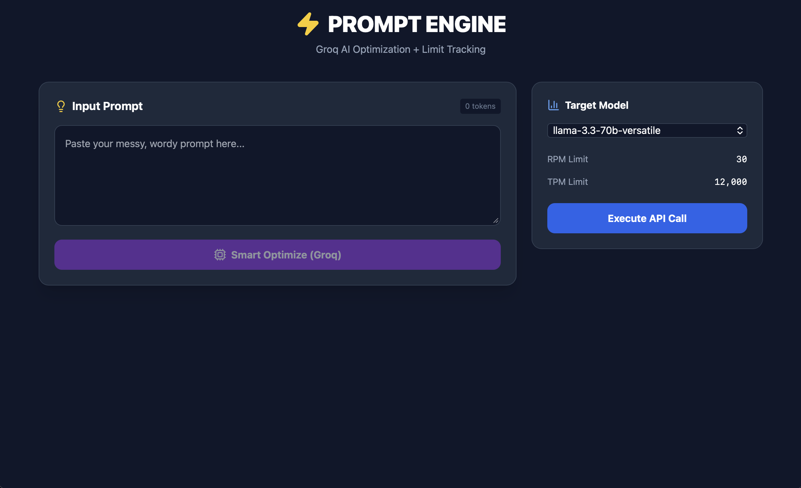

# Prompt Improvise


Prompt Improvise is a modern, full-stack application designed to optimize and execute AI prompts using the Groq API. By leveraging powerful Large Language Models (LLMs), it assists users in refining their prompts for maximum token efficiency and effectiveness, ensuring better results from AI interactions.



## Table of Contents

- [Features](#features)
- [Tech Stack](#tech-stack)
- [Prerequisites](#prerequisites)
- [Installation](#installation)
- [Configuration](#configuration)
- [Usage](#usage)
- [API Documentation](#api-documentation)
- [Project Structure](#project-structure)
- [Contributing](#contributing)
- [License](#license)

## Features

-   **Smart Prompt Optimization**: Automatically analyzes and rewrites user prompts to be more concise and improved for LLM comprehension.
-   **Multi-Model Support**: Seamlessly switch between various Groq-hosted models such as `llama-3.3-70b-versatile` and `llama-3.1-8b-instant`.
-   **Real-time Usage Tracking**: Monitor token consumption and daily request limits to stay within API quotas.
-   **Clean & Modern UI**: A responsive, user-friendly interface built with React and Tailwind CSS.
-   **Secure Backend**: An Express.js server that securely handles API keys and requests using the `groq-sdk`.

## Tech Stack

### Frontend
-   **React** (v19)
-   **Vite** - Build tool
-   **Tailwind CSS** - Styling
-   **Lucide React** - Icons

### Backend
-   **Node.js**
-   **Express**
-   **Groq SDK** - For AI model interaction

## Prerequisites

Before you begin, ensure you have the following installed:
-   [Node.js](https://nodejs.org/) (v18 or higher)
-   [npm](https://www.npmjs.com/) (v9 or higher)
-   A valid [Groq API Key](https://console.groq.com/keys)

## Installation

1.  **Clone the repository**:
    ```bash
    git clone https://github.com/your-username/prompt-improvise.git
    cd prompt-improvise
    ```

2.  **Install Server Dependencies**:
    ```bash
    cd server
    npm install
    ```

3.  **Install Client Dependencies**:
    ```bash
    cd ../client
    npm install
    ```

## Configuration

1.  **Server Configuration**:
    Navigate to the `server` directory and create a `.env` file based on the example.
    ```bash
    cd server
    cp .env.example .env
    ```

2.  **Environment Variables**:
    Open the `.env` file and add your Groq API key:
    ```env
    GROQ_API_KEY=your_groq_api_key_here
    PORT=3000
    ```

## Deployment

### Frontend (Vercel)

1.  **Push to GitHub**: Ensure your project is pushed to a GitHub repository.
2.  **New Project**: Go to [Vercel](https://vercel.com/) and add a new project from your repository.
3.  **Framework Preset**: Select **Vite**.
4.  **Root Directory**: Select `client`.
5.  **Environment Variables**:
    -   Add `VITE_API_URL` with the URL of your deployed Render backend (e.g., `https://prompt-improvise-backend.onrender.com`).
6.  **Deploy**: Click **Deploy**. Use the provided `vercel.json` in the `client` directory if needed for advanced routing, but Vercel usually handles Vite apps automatically.

### Backend (Render)

1.  **New Web Service**: Go to [Render](https://render.com/) and create a new Web Service.
2.  **Connect Repository**: Connect your GitHub repository.
3.  **Configuration**:
    -   **Root Directory**: `server`
    -   **Build Command**: `npm install`
    -   **Start Command**: `npm start`
4.  **Environment Variables**:
    -   Add `GROQ_API_KEY` with your actual API key.
    -   `PORT` is automatically handled by Render, but the server listens on `process.env.PORT` so it will work.
5.  **Blueprint (Optional)**: Alternatively, you can use the provided `render.yaml` to create a Blueprint instance.

## Usage

1.  **Start the Backend Server**:
    In your terminal (from the root or `server` directory):
    ```bash
    cd server
    npm run dev
    ```
    The server will start on `http://localhost:3000`.

2.  **Start the Frontend Client**:
    Open a new terminal window and run:
    ```bash
    cd client
    npm run dev
    ```
    The application will typically start on `http://localhost:5173`. Open this URL in your browser.

3.  **Optimize & Execute**:
    -   Enter your prompt in the text area.
    -   Click **"Smart Optimize (Groq)"** to refine it.
    -   Select a target model and click **"Execute API Call"** to get the AI's response.

## API Documentation

The backend exposes the following endpoints:

### `POST /api/optimize`
Optimizes a given prompt for better performance.
-   **Body**: `{ "prompt": "Your prompt here" }`
-   **Response**: Returns the optimized prompt and comparison metrics.

### `POST /api/execute`
Executes a prompt against a specified Groq model.
-   **Body**: 
    ```json
    {
      "prompt": "Your optimized prompt",
      "model": "llama-3.3-70b-versatile"
    }
    ```
-   **Response**: Returns the model's completion.

## Project Structure

```
prompt-improvise/
├── client/                 # Frontend React application
│   ├── src/                # Source code
│   ├── public/             # Static assets
│   └── package.json        # Client dependencies
├── server/                 # Backend Express application
│   ├── services/           # Business logic (Groq integration)
│   ├── index.js            # Main server entry point
│   ├── .env.example        # Environment variable template
│   └── package.json        # Server dependencies
├── README.md               # Project documentation
└── LICENSE                 # License file
```

## Contributing

Contributions are welcome! Please follow these steps:
1.  Fork the repository.
2.  Create a new branch (`git checkout -b feature/AmazingFeature`).
3.  Commit your changes (`git commit -m 'Add some AmazingFeature'`).
4.  Push to the branch (`git push origin feature/AmazingFeature`).
5.  Open a Pull Request.

## License

This project is open source and available under the [MIT License](LICENSE).
